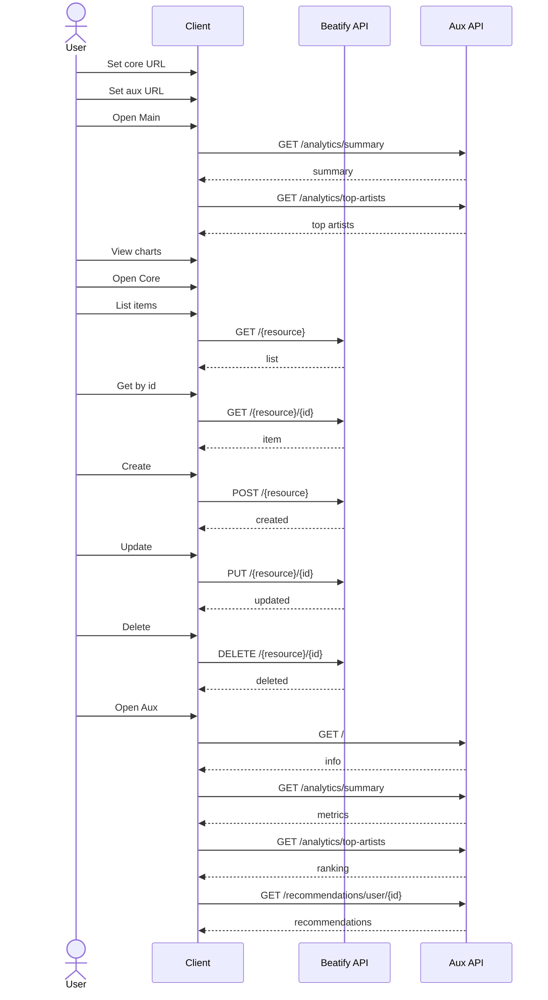

# PWP_JHHT Client

## Overview

This Streamlit client consumes:

- Core Beatify API: `https://jhtt-api.onrender.com/Beatify/api/v1`
- Auxiliary service API: `https://jhttclient.onrender.com/`

The UI is organized into three navigation areas:

- **Main**: Dashboard and analytics visualizations
- **Core**: CRUD workflows for Artists, Albums, Tracks, Users, Playlists
- **Aux**: Auxiliary service overview, summary, top artists, recommendations

## Install and Run

From project root:

```bash
cd API_Client_Auxiliary_service/PWP_JHHT_CLIENT
pip install -r requirements.txt
streamlit run app.py
```

## Docker

Run with compose from the parent folder:

```bash
cd API_Client_Auxiliary_service
cp .env.example .env
docker compose up -d --build
```

Client URL:

- `http://localhost:8501`

## Client Communication Diagram (Complete)

The following vertical communication diagram covers all client use cases.



## Features Checklist

- Configurable core and auxiliary base URLs
- Dashboard cards and charts
- Core resource list/read/create/update/delete flows
- Auxiliary analytics and recommendation views
- Table-oriented data presentation

## Auxiliary Service Run Command

Run in a separate terminal:

```bash
cd API_Client_Auxiliary_service/auxiliary_service
pip install -r requirements.txt
python service.py
```

## Linting

```bash
cd API_Client_Auxiliary_service/PWP_JHHT_CLIENT
pylint app.py api_client.py --rcfile=../.pylintrc --reports=y
```

## Sources

- Streamlit docs: https://docs.streamlit.io/
- Requests docs: https://requests.readthedocs.io/
